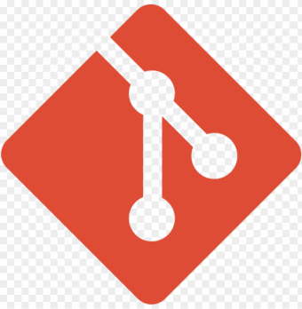
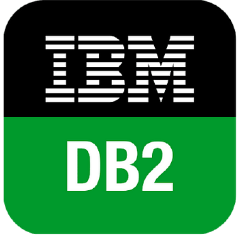
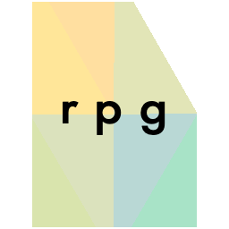
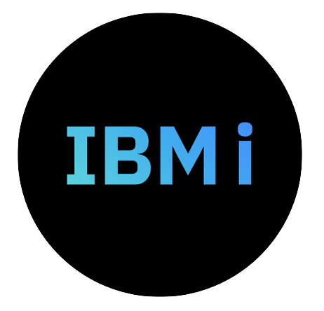

<h2 align="center">Hi there, I'm <a href="https://www.linkedin.com/in/rtorrezluna/">Roberto Torrez</a> 👋</h2>

<h2 align="center">I'm a Software Engineer</h2>

 I develop agile and modern solutions for the financial sector, implementing IBM and open source technology. I'd like to bring People, Modernization and AI to the Power.

  

### 🔭 Current Projects

* [IBM I OS](https://github.com/kraudy/ibmi_os): A guideline to the IBM I Operating System.
* [IBM I Pipeline](https://github.com/kraudy/IBM-i-pipeline): A modern IBM I Pipeline
* [IBM i Talks](https://github.com/kraudy/ibmi_talks): A collection of IBM i talks that I have given or will be giving.
* [Mojograd](https://github.com/kraudy/mojo-grad): An autograd engine written in Mojo.
* [c_stuff](https://github.com/kraudy/c_stuff): Various low level, algorithms and OS related projects.
* [tinygrad-learn](https://github.com/kraudy/tinygrad-learn): Various ML project.

### 🌱 Comming soon

* [RPG Languaje](): A guideline to the RPG Languaje.
* [DB2 Engine](): A guideline to the DB2 SQL Engine.
* [AIX OS](): A guideline to the AIX Operating System.

### 💼 Languages and Tools

 

### 📫 Connect With Me

[LinkedIn](https://www.linkedin.com/in/rtorrezluna/)
[Email](mailto:robkraudy@gmail.com)

 

### 📋 GitHub Stats

